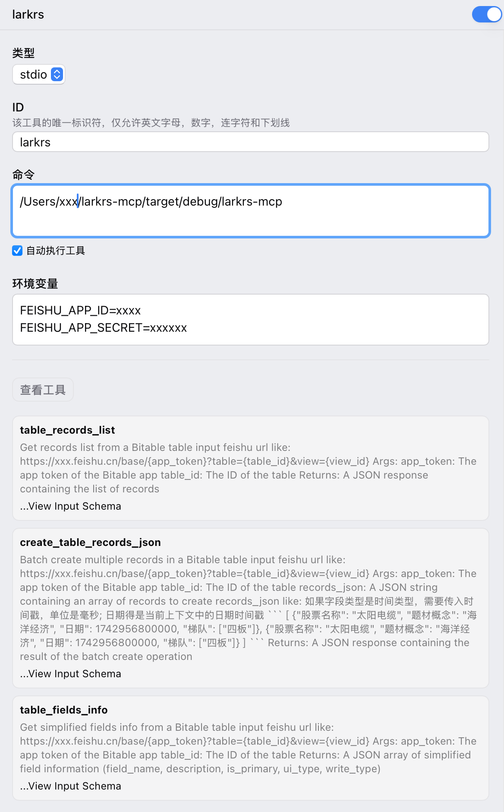

# Lark rs MCP

飞书MCP服务器是一个基于MCP的服务，提供飞书API集成，使AI模型能够轻松与飞书服务交互。

## 功能特点

- 多维表格: 读取多维表格元数据和内容, 提供批量创建记录的功能
- 多模式支持: 目前仅支持STDIO模式
    - STDIO：通过标准输入/输出通信，适用于CLI环境和集成到其他应用

## 配置

> 目前仅支持验证chatwise中的运行情况

首先将本项目克隆到本地:

```bash
cd /path/to/your/project
git clone https://github.com/your-repo/larkrs-mcp.git
```

然后使用 `cargo build` 编译项目:

```bash
cd larkrs-mcp
cargo build
```

将编译产物的路径直接复制到MCP client的命令中, 例如:



在运行时，按照 `.env.example` 的格式书写你的环境变量，用于验证飞书身份。
